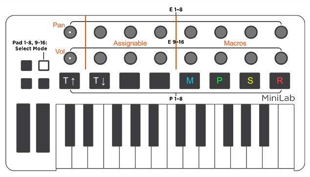

# Arturia MiniLab Mk II for Bitwig

## Setup

2 steps are required:

### 1. Arturia MIDI Control Center

- Open Arturia MIDI Control Center
- To use this, you need to create a Bitwig profile in one of the 7 empty banks of the Minilab
- Select the 16 knobs, the Shift+Knob1 and the Shift+Knob9, and change all of them to Relative#1 in Option.
- Then select the Knob9 Switch, and in Option, change this to Toggle.
- You're ready!, now, simply copy the script file to the Controller Scripts folder inside your Bitwig documents folder.

### 2. Bitwig

- Place `minilab-mk*.control.js` into `~/Documents/Bitwig Studio/Controller Scripts`.
- Choose the controller script from `Settings -> Controller -> Add controller manually`.
- Select `Arturia MiniLab mkII` as input and output each.

## Usage

POSSIBLY OUTDATED IMAGE:

### Knobs

- Knobs 1 to 4, and 9 to 12: with these, you will control the device macros. So for any synth or plugin, you only need to create various controller pages. And depending on which one is selected, the script will auto-adapt. In this way, with only 8 knobs, you can control 100% of your parameters. The best thing is that the knobs in the controller are in the same position as in Bitwig macros pages. It's super intuitive! And of course, you can also create control devices for your iOS apps, if you have your iPad connected to your Mac via Studiomux.
- Knobs 5 to 7, and 13 to 15, are freely assignable.
- Knob 8 will control the panning of the current selected track.
- Knob 16 will control the volume of the current selected track.
- Clicking the Knob 1, you will Stop the track. In case that you want to return the playhead to its starting position.
- Clicking the Knob 9, you will open or close the VST plugin window. Ideal for live performances/streaming, if you want to show what you are doing in your session via a monitor.
- With Shift+Knob 1, you will reset the panning of the selected track to its default value.
- With Shift+Knob 9, you will reset the volume of the selected track to its default value.

### Pads

- Pads 1 to 8 will act as drum pads. They are not colored. In this way, when you close Bitwig, you can turn off all the lights, by simply selecting this bank of pads!
- With Pad 9 and Pad 10 (dark blue), you will move up and down between the different Macro pages. So you can access all the parameters of your synth or effect, with only the Minilab.
- With Pad 11 and Pad 12 (light blue), you can move left and right between the device chain. Selecting the different plugins on the fly.
- With Pad 13 and Pad 14 (white), you can move up and down between the different tracks.
- Pad 15 (orange) is the Play/Pause button.
- Pad 16 (red) is the Record button.

# Credits

- [bequadro](https://twitter.com/_bequadro) / [chrenn](https://github.com/chrenn/minilab-mk2-bitwig)
- [Nettsu](https://github.com/Nettsu/minilab-mkII-bitwig)
- [Pynchon](https://forum.audiob.us/discussion/50398/my-bitwig-controller-script-for-the-arturia-minilab-mk-ii-control-entire-live-sessions)

